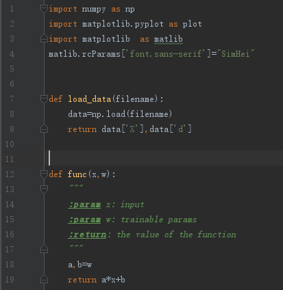
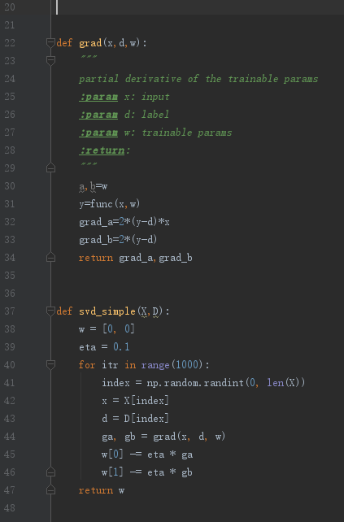
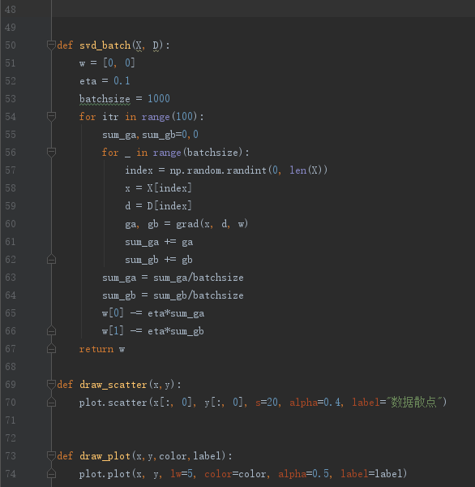
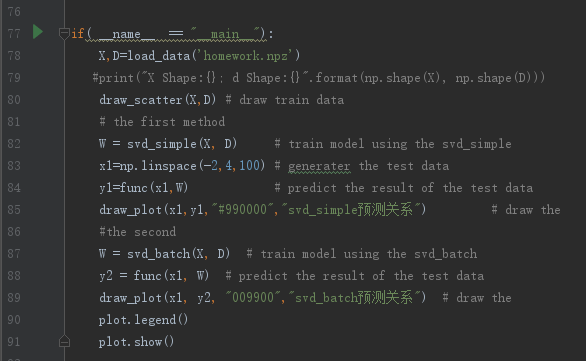
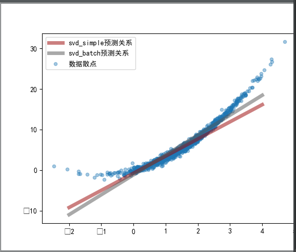

程序代码：

    使用python库说明：
         python 3.7.0
         numpy  1.16.2
         matplotlib 3.0.0

执行结果：

是否有更好的建模方式？

    应该是有的，根据数据散点图显示在[-2,0]区间的数据变化比较平缓，可以用分段数据训练，预测。

如何评价更好？
    
     可以根据（预测值-样本值的平均值）**2来估算训练模型的拟合程度。

 
    
